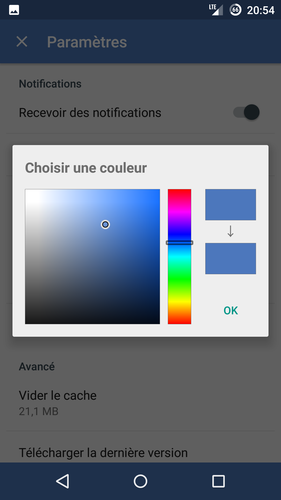

# RUVCom

### Description

RUVCom est une application Android de partage de photos et de messages entre utilisateurs

#### Principe

L'utilisateur peut prendre une photo et l'envoyer à un autre utilisateur en y joignant, ou non, un message. L'utilisateur est notifié d'un nouveau message et peut alors répondre à son correspondant.

Liens vers le dépôt du serveur : 
https://github.com/LPRonanUgho/RUVComServer

#### By

> - Ugho Stephan
> - Valentin Bourreau
> - Ronan Legardinier

### Captures d'écran

  
  
  
  
  

